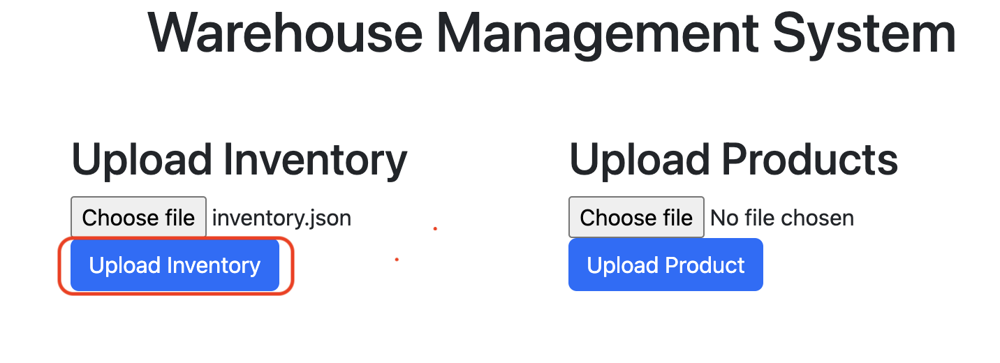
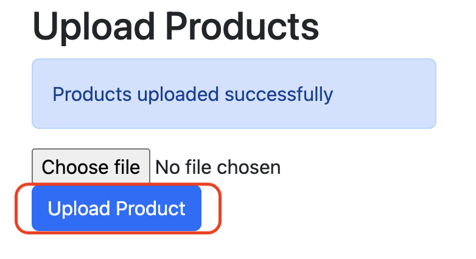
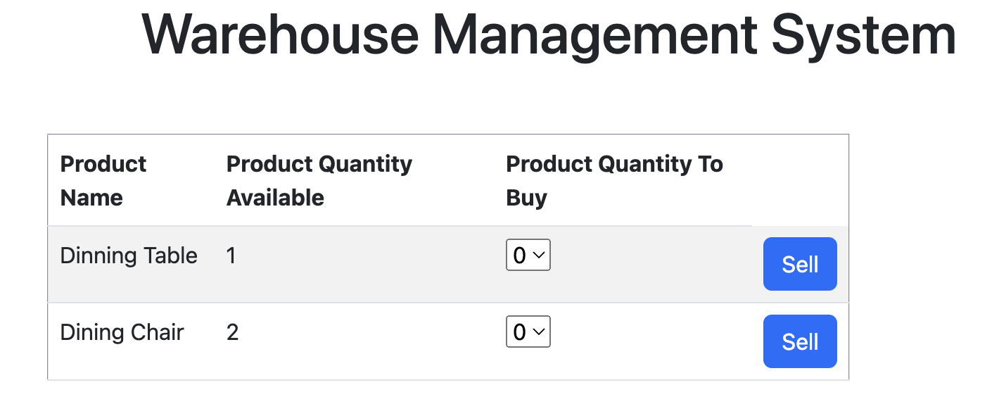

# Getting Started

## The Task
The assignment is to implement a warehouse software. This software should hold articles, and the articles should contain an identification number, a name and available stock. 
It should be possible to load articles into the software from a file, see the attached inventory.json.
The warehouse software should also have products, products are made of different articles. Products should have a name, price and a list of articles of which they are made from with a quantity. 
The products should also be loaded from a file, see the attached products.json. 
 
The warehouse should have at least the following functionality;
* Get all products and quantity of each that is an available with the current inventory
* Remove(Sell) a product and update the inventory accordingly

## Instructions
1) Start SpringBoot Application by running main method of ManagementSystemApplication.java
2) UI will be server at http://localhost:8080
3) Upload Inventory.json using UploadInventory button 

4) Upload Products.json using Upload Product button

5) Table with Product and Quantity would be visible:

6) Select Quantity to sell and click on Sell Button.

